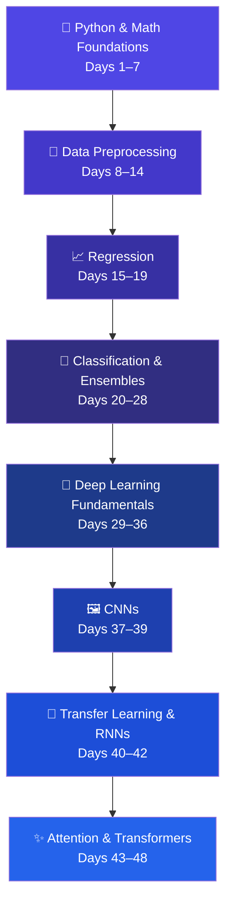

<div align="center">

# 🧠 project48

### A 48-Day Deep Dive into Machine Learning & Deep Learning
##### From Python fundamentals to building a Transformer from scratch

<br/>


<br/>

<table>
<tr>
<td align="center"><b>📅 48</b><br/><sub>Days</sub></td>
<td align="center"><b>🧭 8</b><br/><sub>Phases</sub></td>
<td align="center"><b>🧪 5+</b><br/><sub>Mini-Projects</sub></td>
<td align="center"><b>🧠 40+</b><br/><sub>Concepts Covered</sub></td>
<td align="center"><b>💻 100%</b><br/><sub>Python</sub></td>
</tr>
</table>

</div>

---

## 📖 Table of Contents

- [About](#-about)
- [Learning Journey](#-learning-journey)
- [Skills Gained](#-skills-gained)
- [Roadmap](#-roadmap)
- [Day-by-Day Log](#-day-by-day-log)
- [Tech Stack](#-tech-stack)
- [Featured Projects](#-featured-projects)
- [Repository Structure](#-repository-structure)
- [Getting Started](#-getting-started)
- [Author](#-author)
- [License](#-license)

---

## 🎯 About

**project48** is a self-paced, 48-day structured study log covering the full arc of modern ML/DL — from Python and linear algebra, through classical machine learning, into deep learning, sequence models, and finally the **Transformer architecture**, implemented from scratch.

Every day is captured as a dated commit, turning the commit history itself into a learning journal — theory, math derivations, and hands-on code side by side.

> 💡 **48 days. Zero to Transformers.**

---

## 🧭 Learning Journey



---

## 🧩 Skills Gained

**Foundations**
Python (OOP, file I/O, comprehensions), NumPy, linear algebra, calculus for ML

**Data Handling**
Missing-value imputation, encoding, scaling, outlier treatment, feature-engineering pipelines

**Classical ML**
Regression (Linear, Ridge, Lasso, Elastic Net) · Classification (Logistic, SVM, Naive Bayes, KNN) · Tree ensembles (Random Forest, AdaBoost, Gradient Boosting, XGBoost) · Clustering (K-Means, DBSCAN, Agglomerative)

**Deep Learning**
ANNs & backpropagation from scratch, optimizers (Adam, RMSprop, AdaGrad), regularization & normalization, CNNs (LeNet, image classification), transfer learning

**Sequence Models & NLP**
RNN / LSTM / GRU (incl. bidirectional) · attention mechanisms (Bahdanau, Luong) · full Transformer architecture (self-attention, multi-head attention, positional encoding, encoder–decoder, cross-attention)

---

## 🗺️ Roadmap

| Phase | Days | Focus | Status |
|:---:|:---:|---|:---:|
| **1** | 1–7 | Python core, OOP, NumPy, linear algebra, SVD, calculus | ✅ |
| **2** | 8–14 | Missing data, scaling, encoding, outliers, feature engineering, AutoDataCleaner | ✅ |
| **3** | 15–19 | Linear/polynomial regression, gradient descent, Ridge, Lasso, Elastic Net | ✅ |
| **4** | 20–28 | Logistic regression, metrics, Naive Bayes, SVM, trees, bagging, boosting, XGBoost, clustering | ✅ |
| **5** | 29–36 | Perceptron, MLPs, backprop, regularization, dropout, batch norm, optimizers | ✅ |
| **6** | 37–39 | CNN fundamentals, LeNet, cats vs. dogs classifier | ✅ |
| **7** | 40–42 | Transfer learning, RNNs, LSTM, GRU, bidirectional models | ✅ |
| **8** | 43–48 | Attention mechanisms, self/multi-head/cross-attention, full Transformer | ✅ |

---

## 📅 Day-by-Day Log

> **Note on numbering:** Day labels below come directly from the original commit messages. The source history skips "Day 17," reuses "Day 18" and "Day 19" across two different dates each, and leaves a couple of commits unlabeled — all preserved as-is to keep the log authentic. The **48-day** count above reflects calendar days of the challenge (Jun 3 – Jul 20, 2026), not literal day-number labels.

<details>
<summary><b>📂 Click to expand the full 48-day commit log</b></summary>
<br/>

| Day | Date | Topics Covered |
|:---:|---|---|
| 01 | Jun 3, 2026 | Python types, variables, loops, comprehensions, OOP, try/except, file I/O, memory management |
| 02 | Jun 4, 2026 | OOP, matrix addition math, advanced Python concepts |
| 03 | Jun 5, 2026 | NumPy engine, Jupyter notebook workflow |
| 04 | Jun 6, 2026 | Mathematics for ML — linear algebra |
| 05 | Jun 7, 2026 | Linear algebra, SVD, image compressor |
| 06 | Jun 8, 2026 | Calculus fundamentals, building a calculus engine |
| — | Jun 9, 2026 | Calculus for Machine Learning |
| 08 | Jun 10, 2026 | Complete Case Analysis (CCA), missing data handling |
| 09 | Jun 11, 2026 | KNN and iterative missing data imputation |
| 10 | Jun 12, 2026 | Standardization, normalization, pipelines, one-hot encoding |
| 11 | Jun 13, 2026 | Transformers intro, discretization/binarization |
| 12 | Jun 14, 2026 | Outliers, feature splitting, datetime features |
| 13 | Jun 15, 2026 | AutoDataCleaner project |
| 14 | Jun 16, 2026 | AutoDataCleaner project (continued) |
| 15 | Jun 17, 2026 | Simple & multiple linear regression |
| 16 | Jun 18, 2026 | Gradient descent |
| 18 | Jun 19, 2026 | Types of gradient descent, polynomial regression |
| 18 | Jun 20, 2026 | Ridge regression |
| 19 | Jun 21, 2026 | Lasso regression |
| 19 | Jun 22, 2026 | Lasso & Elastic Net regression |
| 20 | Jun 22, 2026 | Logistic regression (GD, sigmoid function) |
| 21 | Jun 23, 2026 | Confusion matrix, ROC-AUC, softmax, polynomial logistic regression |
| 22 | Jun 24, 2026 | Naive Bayes, KNN, SVM, kernel trick |
| 23 | Jun 25, 2026 | Decision trees, voting ensemble |
| 24 | Jun 26, 2026 | Bagging, random forest |
| 25 | Jun 27, 2026 | AdaBoost |
| 26 | Jun 28, 2026 | Gradient boosting & mathematics |
| 27 | Jun 29, 2026 | XGBoost library & underlying math |
| 28 | Jun 30, 2026 | Clustering — K-means, Agglomerative, DBSCAN |
| 29 | Jul 1, 2026 | Intro to deep learning, history, hardware requirements, perceptron |
| 30 | Jul 2, 2026 | Perceptron loss function, MLP, ANN churn-modelling project |
| 31 | Jul 3, 2026 | Digit classifier, GRE admission predictor, backpropagation theory & math |
| 32 | Jul 4, 2026 | Backpropagation from scratch, vanishing gradients in ANNs |
| 33 | Jul 5, 2026 | Batch/stochastic/mini-batch GD, early stopping, dropout |
| 34 | Jul 6, 2026 | Regularization, activation functions, weight initialization |
| 35 | Jul 7, 2026 | Weight init, batch normalization, momentum, NAG |
| 36 | Jul 8, 2026 | AdaGrad, RMSprop, Adam optimizers; Keras hyperparameter tuning |
| 37 | Jul 9, 2026 | Padding, strides, pooling, LeNet, backpropagation theory |
| 38 | Jul 10, 2026 | Forward & backward propagation in CNNs |
| 39 | Jul 11, 2026 | Cat vs dog detector (Colab notebook) |
| 40 | Jul 12, 2026 | Data augmentation, pretrained models, transfer learning, functional API, RNN intro |
| — | Jul 12, 2026 | Updated `.gitignore` |
| 41 | Jul 13, 2026 | LSTM architecture & underlying math |
| 42 | Jul 14, 2026 | GRU, deep RNN/LSTM/GRU, bidirectional RNN/LSTM/GRU |
| 43 | Jul 15, 2026 | Encoder-decoder, attention mechanism, Bahdanau & Luong attention |
| 44 | Jul 16, 2026 | Intro to transformers, self-attention |
| 45 | Jul 17, 2026 | Scaled dot-product attention, geometric intuition, multi-head attention |
| 46 | Jul 18, 2026 | Positional encoding, layer normalization in transformers |
| 47 | Jul 19, 2026 | Encoder architecture, masked multi-head attention |
| 48 | Jul 20, 2026 | Cross-attention, decoder architecture, training & inference — **series complete!** 🎉 |

</details>

---

## 🛠️ Tech Stack

<div align="center">


</div>

---

## 🌟 Featured Projects

| Project | Days | Description |
|---|:---:|---|
| 🧹 **AutoDataCleaner** | 13–14 | An automated pipeline for cleaning and preprocessing messy datasets |
| 📉 **Churn Modelling ANN** | 30 | Customer churn prediction using a multi-layer perceptron |
| 🔢 **Digit Classifier** | 31 | Handwritten digit recognition neural network |
| 🐱🐶 **Cat vs. Dog Detector** | 39 | CNN-based image classifier trained on Colab |
| ✨ **Transformer from Scratch** | 44–48 | Full encoder–decoder architecture with self-, multi-head, and cross-attention |

---

## 📂 Repository Structure

```
project48/
├── Day_01/           # Python fundamentals
├── Day_02/           # OOP & matrix math
├── ...
├── Day_13-14/        # AutoDataCleaner project
├── ...
├── Day_39/           # Cat vs Dog CNN classifier
├── ...
└── Day_44-48/        # Transformer architecture (encoder, decoder, attention)
```

Each day's folder/notebook contains notes, code, and any related mini-projects for that day's topic.

---

## 🚀 Getting Started

```bash
# Clone the repository
git clone https://github.com/yogeshsikhwal77/project48.git
cd project48

# (Optional) create a virtual environment
python -m venv venv
source venv/bin/activate    # on Windows: venv\Scripts\activate

# Install common dependencies
pip install numpy pandas scikit-learn tensorflow matplotlib xgboost jupyter
```

Then open any `Day_XX` notebook in Jupyter or Colab and follow along.

---

## 👤 Author

<div align="center">

**Yogesh Sikhwal**

[](https://github.com/yogeshsikhwal77)

</div>

---

## 📄 License

No license specified yet — add one (e.g. MIT) if you'd like others to reuse this code.

---

<div align="center">

**If this repo helped or inspired you, consider giving it a ⭐**

</div>